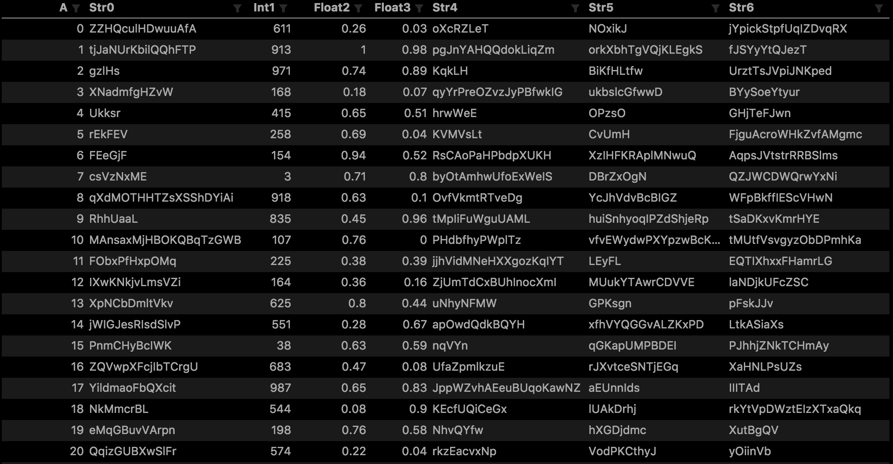
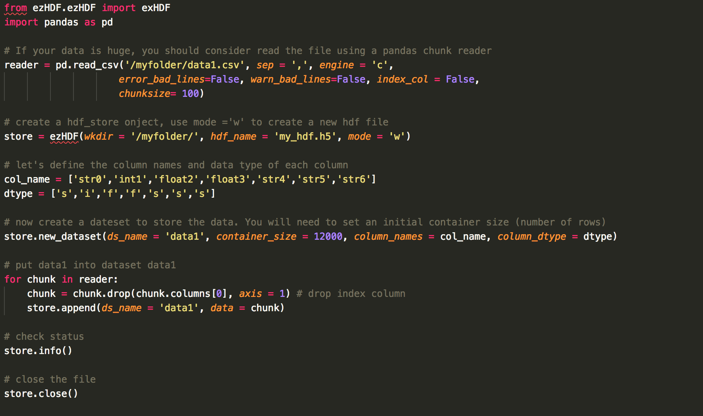
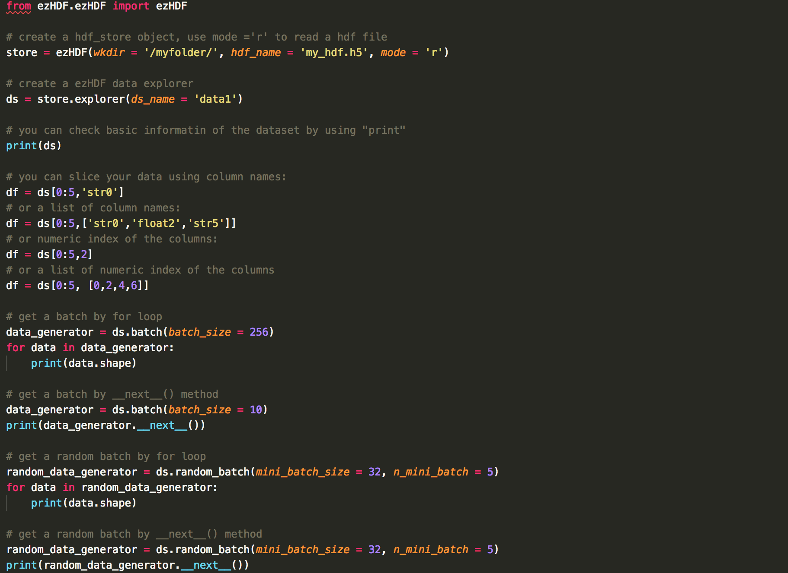

# Welcome to ezHDF
## What is ezHDF5
ezHDF is a simple tool you help you use HDF5 in combination with pandas to store and read hugh amount of data.

HDF5 is a novel data storage format. It can read, store and query huge amount of data without any difficult. It can also help you handle large data even in your light-weighted laptop thank to its memory-map based mechnism (i.e. move data to RAM only when you slice it). So you can slice into multi-terabyte datasets stored on disk, as if they were real NumPy arrays. For an quick introduction, see the official website of [hyp5](http://docs.h5py.org/en/stable/). 

## Why do we need ezHDF?
There are many options to use HDF5 in python, e.g. [hyp5](http://docs.h5py.org/en/stable/) and [PyTables](https://www.pytables.org/). [Pandas](https://pandas.pydata.org/pandas-docs/stable/io.html#hdf5-pytables) also has provides an user interface to PyTables. Alghouth they are all very powerful tools, they are all hard to use (at least, for me) because there are many "mysterious" tricks to use them properly. For example, if you want append new string data to a dataset in Pandas / PyTables, [you may get error message if the length of strings of newly appended data are different](https://stackoverflow.com/questions/22710738/pandas-pytable-how-to-specify-min-itemsize-of-the-elements-of-a-multiindex). Also, appending new data will become [extremely slow when the dataset become larger and larger and eventually crashes.](https://stackoverflow.com/questions/22934996/pandas-pytables-append-performance-and-increase-in-file-size) 

h5py also has it own disadvantages. hyp5 is highly compatible to numpy but it does not offer any user interface to pandas. In addition, hyp5 also requires [special tricks when storing compound data types.](https://github.com/h5py/h5py/issues/735) If you want to use h5py to store pandas data frame, you may want to use "dataset.attrs" to store some information of the dafa frame. However, it also requires [additional cautions when using strings](http://docs.h5py.org/en/latest/strings.html). 

In short, neither h5py nor PyTables are very user friendly tools for new users (again, for me at least) who just want to store and explore large data. That's why I develop ezHDF. 

ezHDF provides a simple and convenient interfaces to bridge h5py and pandas. Users can quickly and painlessly store large amounts of data and restore a pandas data frame by just a few commands. 

## How does ezHDF work?
ezHDF is essentially an API to h5py. HDF5 is a hierarchical data format which means you can have two data level: "group" and "dataset". Based on my experience (so, maybe not universally correct), if a dataset has the same data type, it can be much faster than compound data type. Besides, using only one type in a data set can also avoid possible issues due to compound data type. 

Therefore, in ezHDF, I split each column in a pandas data frame as a single "dataset" in HDF5 and combined all dataset (i.e. all columns) as a group. It makes HDF5 runs very fast and avoid all the issues due the compound data in a single dataset. 

Despite the above idea is useful for data storage, it makes the data slicing tedious. Therefore, I redefined a new data structure, "ezHDF dataset", to help users conveniently fetch data from a HDF file. Users can eaily fetch data using a pandas-like format and automatically returns a pandas data frame. 

## Benchmark
To have a benchmark test, I used a csv file that contains 30M rows (8 Gb on hard disk). Each row has 7 columns, 4 of them are variable length strings and the other three are integers, float and float respectively. Then I use pandas to read the file with 100K rows per chunk and pass to ezHDF for storing. The output h5 files has 16G. It takes only 4 mins to finish the job on my laotop (i7-4750HQ). That means dealing with **25G (8G in + 16G out) throughput less than 300 seconds in an old laptop !**. 

very fast ! isn't it? 

## Installation

**pip install ezHDF**

## Usage
Note that, the term "dataset" in ezHDF is different from the term "dataset" in h5py. Since ezHDF use a group in h5py to store all columns in Pandas, there is no "group" in ezHDF. 

There are two Jupyter files in the examples folder:  
* [ex_store_data.ipynb](https://github.com/pipidog/ezHDF/blob/master/example/ex_store_data.ipynb): this file shows how to store huge amout of data using ezHDF

* [ex_explore_data.ipynb](https://github.com/pipidog/ezHDF/blob/master/example/ex_explore_data.ipynb): this file shows how to explore a ezHDF file using it built API. 

If you want to generate your own test dataset, you can use the file **generate_random_data.py** to generate your own test dataset. 

You should be able to fully understand how to use it within a few minutes by reading the above files carefully. 

## Quick Guide:
I strongly recommend you read the examples files, so you will have a comprehensive understanding of ezHDF. I provide a quick guide for those who just want to browse the whole project:

Consider we have a dataset like this:
<p align="center">
    
</p>
There 6 columns with types string, integer, ..., etc. Their column names are 'int1', 'float2', ..., etc. If you want to store the data, follow the stpes:

``` python
from ezHDF.ezHDF import exHDF
import pandas as pd

# If your data is huge, you should consider read the file using a pandas chunk reader
reader = pd.read_csv('/myfolder/data1.csv', sep = ',', engine = 'c', 
                    error_bad_lines=False, warn_bad_lines=False, index_col = False,
                    chunksize= 100)

# create a hdf_store onject, use mode ='w' to create a new hdf file
store = ezHDF(wkdir = '/myfolder/', hdf_name = 'my_hdf.h5', mode = 'w')

# let's define the column names and data type of each column
col_name = ['str0','int1','float2','float3','str4','str5','str6']
dtype = ['s','i','f','f','s','s','s']

# now create a dateset to store the data. You will need to set an initial container size (number of rows) 
store.new_dataset(ds_name = 'data1', container_size = 12000, column_names = col_name, column_dtype = dtype)

# put data1 into dataset data1
for chunk in reader:
    chunk = chunk.drop(chunk.columns[0], axis = 1) # drop index column
    store.append(ds_name = 'data1', data = chunk)

# check status 
store.info()

# close the file
store.close()
```

<!-- <p align="center">
    
</p> -->


If a file is stored using ezHDF, you can also explore the data using ezHDF's built API:    

```python

from ezHDF.ezHDF import ezHDF

# create a hdf_store object, use mode ='r' to read a hdf file
store = ezHDF(wkdir = '/myfolder/', hdf_name = 'my_hdf.h5', mode = 'r')

# create a ezHDF data explorer 
ds = store.explorer(ds_name = 'data1')

# you can check basic informatin of the dataset by using "print"
print(ds)

# you can slice your data using column names:
df = ds[0:5,'str0']
# or a list of column names:
df = ds[0:5,['str0','float2','str5']]
# or numeric index of the columns:
df = ds[0:5,2]
# or a list of numeric index of the columns
df = ds[0:5, [0,2,4,6]]

# get a batch by for loop
data_generator = ds.batch(batch_size = 256)
for data in data_generator:
    print(data.shape)

# get a batch by __next__() method
data_generator = ds.batch(batch_size = 10)
print(data_generator.__next__())

# get a random batch by for loop 
random_data_generator = ds.random_batch(mini_batch_size = 32, n_mini_batch = 5)
for data in random_data_generator:
    print(data.shape)

# get a random batch by __next__() method
random_data_generator = ds.random_batch(mini_batch_size = 32, n_mini_batch = 5)
print(random_data_generator.__next__())

'''
you can also reset your random number generator. This will guarantee you get exact 
the same random batch. If you have two different datasets with the same number of 
rows and you want to get the random batch by exactly way (i.e. fetch the same rows 
for every batch), you can also use set reset_seed = True.   
'''
random_data_generator = ds.random_batch(mini_batch_size = 32, n_mini_batch = 5, reset_seed = True)
```

<!-- <p align="center">
    
</p> -->

## More Advanced Use
ezHDF is just an API of h5py. Therefore, you can absolute h5py or any other HDF5 tools to explore the file. To get the h5py File object, simply use the .h5f attribute, e.g:
```python
store = ezHDF('myfile','r')
# the following object is identical to h5f = h5py.File('myfile','r')
store.h5f
```